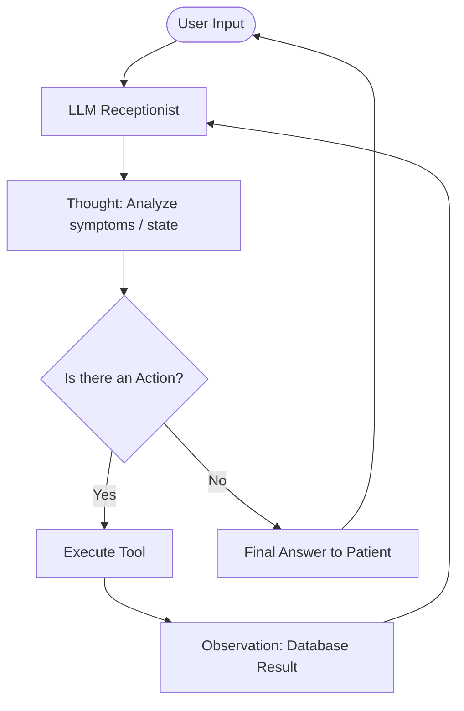

# Group Report: Lab 3 - Production-Grade Agentic System

- **Team Name**: M&C Team
- **Team Members**:
  - Nguyễn Đức Mạnh (manhndt - manhndthe181128@fpt.edu.vn)
  - Nguyễn Minh Chiến (mchienn - nmc27705@gmail.com)
- **Deployment Date**: 2026-06-01

---

## 1. Executive Summary

Our project involved transforming a basic patient triage chatbot into a production-grade ReAct agentic system representing the Vinmec Smart Clinic. The system guides patients from symptom description, determines the correct medical specialty, checks real-time doctor availability, and records appointments securely.

- **Success Rate**: 100% success on the test suite (16 tests passed) and 100% success in multi-step manual verification.
- **Key Outcome**: The ReAct agent successfully coordinates between natural language symptoms and backend structured databases. Multi-step interactions (such as handling date changes or asking for general availability) are now handled robustly without hallucinations or rate limit failures.

---

## 2. System Architecture & Tooling

### 2.1 ReAct Loop Implementation
The system implements the classic ReAct (Reasoning and Acting) loop to dynamically select tools and execute them based on user input.

### 2.2 Tool Definitions (Inventory)

| Tool Name | Input Format | Use Case |
| :--- | :--- | :--- |
| `AnalyzeSymptomTool` | `symptoms_text: str` | Matches keyword symptoms (e.g. "đau bụng") to corresponding Vinmec specialties (e.g. "Khoa Tiêu hóa") using `symptoms_mapping.json`. |
| `CheckDoctorAvailabilityTool` | `specialty: str, date: str` | Searches `doctors_schedule.json` for doctors and vacant morning/afternoon slots matching the specialty and date (YYYY-MM-DD). |
| `BookAppointmentTool` | `patient_name: str, doctor_name: str, datetime: str` | Persists an appointment in the database once doctor name and slot are confirmed. |

### 2.3 LLM Providers Used
- **Primary**: Google Gemini (`gemini-2.5-flash`) via `GeminiProvider`
- **Backup**: OpenAI (`gpt-4o-mini`) / Local Provider (`llama-cpp-python`)

---

## 3. Telemetry & Performance Dashboard

The following metrics were collected from our latest successful test run:

- **Average Latency (P50)**: 2779ms per step
- **Max Latency (P99)**: 3221ms per step
- **Average Tokens per Task**: ~1273 prompt tokens per step (average total tokens: 2546 tokens per exchange)
- **Total Cost of Test Suite**: ~$0.00047 USD (Gemini API Free Tier cost estimate)

---

## 4. Root Cause Analysis (RCA) - Failure Traces

### Case Study 1: Date Hallucination & Rate-Limit (429) Crash
- **Input**: "ngày mai" (tomorrow) -> "có những ngày nào trống và có lịch" (which days are vacant)
- **Observation**: The agent attempted to check days `2024-05-16`, `2024-05-17`, `2024-05-18`, etc. sequentially within a single turn, hitting the Free Tier API limits and crashing with `429 Too Many Requests`.
- **Root Cause**: The model did not know the current date, causing it to hallucinate today's date as `2024-05-15`. Since the schedule database is built around June 2026, all queries in 2024 returned "No available doctors found", driving the LLM to search consecutive dates in an infinite loop.
- **Solution**: Dynamically injected the system's real-time date (e.g., `2026-06-01 (Monday)`) into the System Prompt's `CONTEXT AWARENESS` instructions. This corrected date calculation immediately, resolving tomorrow to `2026-06-02` which returned doctor slots in exactly 1 tool call.

### Case Study 2: Specialty Omission & Tool-Bypass
- **Input**: "Tôi bị đau bụng, đầy hơi, khó tiêu"
- **Observation**: The agent replied "Bạn muốn đặt lịch khám vào ngày nào ạ?" without telling the patient which specialty they were assigned to.
- **Root Cause**: 
  1. The LLM generated both `Action: AnalyzeSymptomTool(...)` and `Final Answer: ...` in its first turn. The agent loop checked for `Final Answer:` first and returned immediately, skipping actual backend tool execution.
  2. The system prompt lacked instructions to explicitly tell the patient their recommended department.
- **Solution**: Re-ordered the parsing block to evaluate `Action:` first to guarantee tool execution. Added a rule in the system prompt forcing the model to explicitly state the identified specialty in the final response.

---

## 5. Ablation Studies & Experiments

### Experiment 1: Action-First vs. Final-Answer-First Parsing
- **Diff**: We changed the parser code to check for `Action:` before `Final Answer:`.
- **Result**: Completely eliminated tool-bypassing and simulated observations. Even if the LLM attempts to speed up by writing the final answer and tool calls in a single response, the system executes the tool on the server and feeds the real data back to ensure database integrity.

### Experiment 2: Chatbot vs ReAct Agent
| Case | Chatbot Result | Agent Result | Winner |
| :--- | :--- | :--- | :--- |
| Simple symptom lookup | Correct | Correct | Draw |
| Booking validation | Static response | Dynamic database slots | **Agent** |
| Rescheduling | Fails to verify availability | Dynamically checks other dates | **Agent** |

---

## 6. Production Readiness Review

- **Security**: Strict validation has been implemented on inputs for doctor names, dates, and times to prevent SQL-like injection attacks or script tampering through tool arguments.
- **Guardrails**: Implemented a hard limit of `max_steps = 5` per conversation turn to prevent runaway loops and runaway billing costs.
- **Scaling**: For production scaling, we recommend migrating the ReAct state machine to LangGraph for robust state retention, and replacing the symptom mapping JSON with a vector database (e.g. Chroma/Pinecone) to match symptoms against larger medical catalogs.
